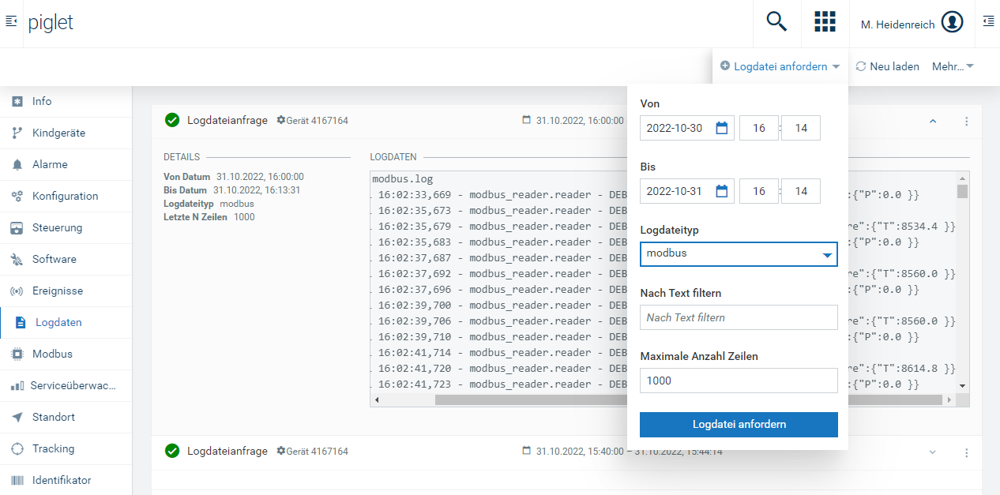

# modbus-plugin

## Requirements
* Ubuntu >= 22.04 or Debian >= 11.0
* Python >= 3.9
* pip

## Build

### Python Wheel
* cd to the source root
* install the build helper via `pip install build` and do a `python -m build`

### Debian package

Make sure to run the following on a build environment that matches the target. 
If you are using a WSL container, make sure that the build directory is not on a Windows path (e.g. /mnt/c),
as Windows filesystem won't handle the permissions correctly (sets +x on everything)

* do the Python Wheel build: install the build helper via `pip install build` and do a `python -m build`
* install all dependencies `sudo apt-get install build-essential debhelper devscripts equivs dh-virtualenv`
* cd into the source root folder (the one that includes the debian directory)
* make changes to the debian/changelog file and increase the version number if necessary 
* run `dpkg-buildpackage -us -uc -b` In case you are running into problems with virtualenv, try a `sudo pip install virtualenv` first

## Deployment

### As Python script (for dev only)
* copy modbus-plugin folder to target device
* ssh into device and go to the plugin folder
* create the virtualenv with `python -m venv venv`
* activate venv environment with `source ./venv/bin/activate`
* install all dependencies with `python -m pip install -r requirements.txt`
* run the reader with `python modbus_reader/reader.py -c ./config`

### As deb file
Run `sudo dpkg -i te-modbus-plugin-<version>-<arch>.deb`

## Logs and systemd service
Executing the deb installer will place the config files into /etc/tedege/plugins/modbus/.
If systemd is installed, it will run the service as part of the post-installation routine.

Check the status of the systemd service with `sudo systemctl status te-modbus-plugin.service`
When running as a service, the default log output goes to /var/log/te-modbus-plugin/modbus.log.

## Config files

All config files are expected to be in the /etc/tedge/plugins/modbus folder. 
As alternative the directory can be based with -c or --configdir to the python script like so:
`python modbus_reader/reader.py --configdir <configfolder>`

### modbus.toml
Includes the basic configuration for the plugin: 
* poll rate
* connection to thin-edge (MQTT broker needs to match the one of tedge)

### devices.toml

Defines the existing child devices and their protocol for polling the Modbus folder.
The structure is based on the Cloud Fieldbus protocols.
Add a `[[device]]` entry for each different IP address

### Updating the config files
A watchdog observer will take care of restarting the MQTT and Modbus connection when either
devices.toml or modbus.toml changes. So there should be no need to manually restart the 
python script / service.

## Cumulocity Integration
### Installation via Software Management

Upload the deb package to the Cumulocity Software Repository. The name **must** be *te-modbus-plugin* and
the version **must** match the version in the *.deb package name (e.g. 1.0.0). The rest of the fields can be set as necessary.
Go to the Software tab of the target device and select the package for installation. After the operation is successfull the plugin will start automatically on the device.

### Log file access

For integration with the C8Y log plugin add the following line to the /etc/tedge/c8y/c8y-log-plugin.toml
   
    { type = "modbus", path = "/var/log/te-modbus-plugin/modbus.log" }

### Config management
Both config files can either be updated in-place (i.e. simply editing with an editor) or
by using the c8y-configuration plugin. Add the following lines to the c8y-configuration-plugin.toml
to be able to access them from the Cumulocity Configuration UI:

    {path = '/etc/tedge/plugins/modbus/modbus.toml', type='modbus'},
    {path = '/etc/tedge/plugins/modbus/devices.toml', type='modbus-devices'}

To replace the files with a version from the C8Y Configuration Repository you have to download a copy, 
edit it and upload it to the repository. The device type **must** be set to *thin-edge.io* and the config type must match 
the definition in your c8y-configuration-plugin.toml. I.e either *modbus* (for modbus.toml) or *modbus-devices* for (devices.toml) 

